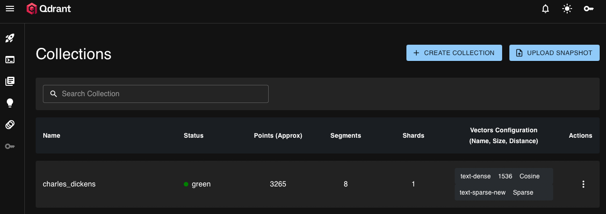
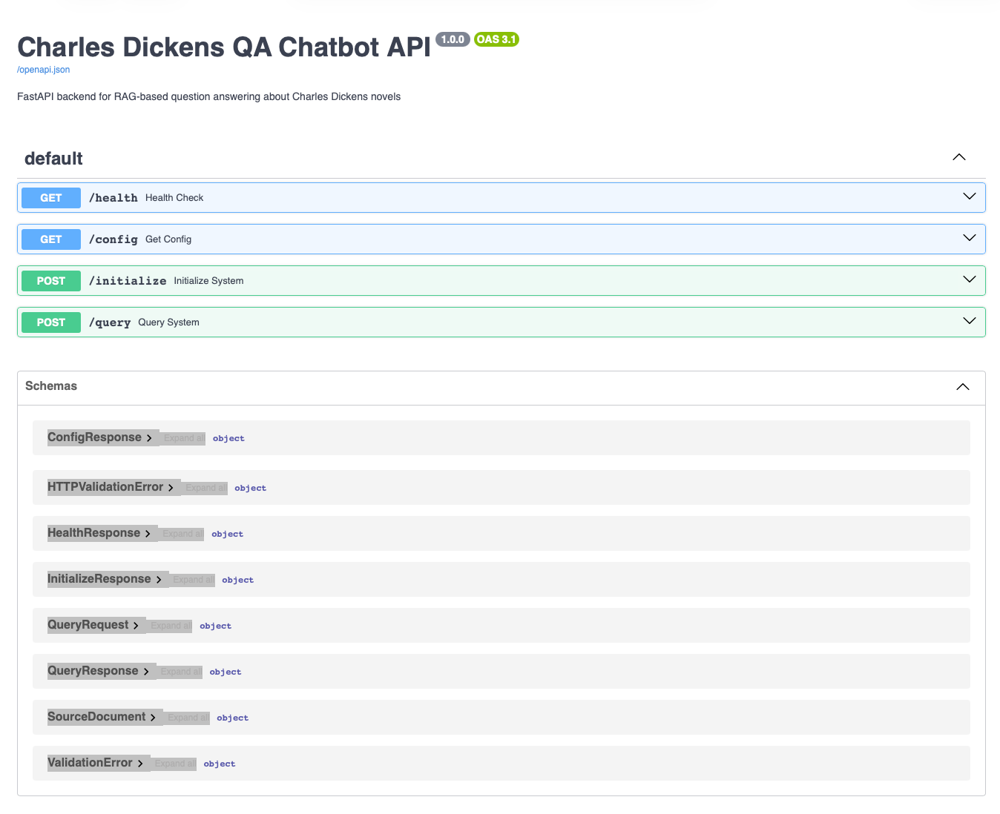
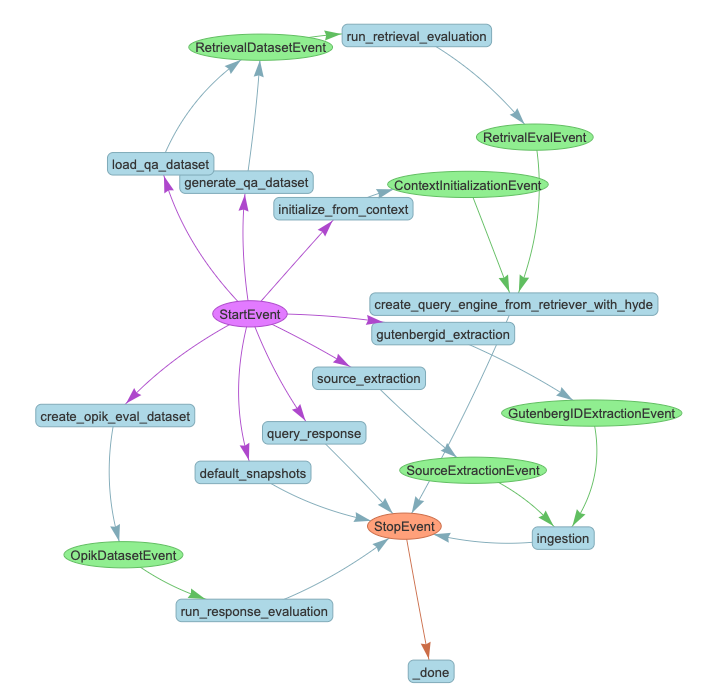
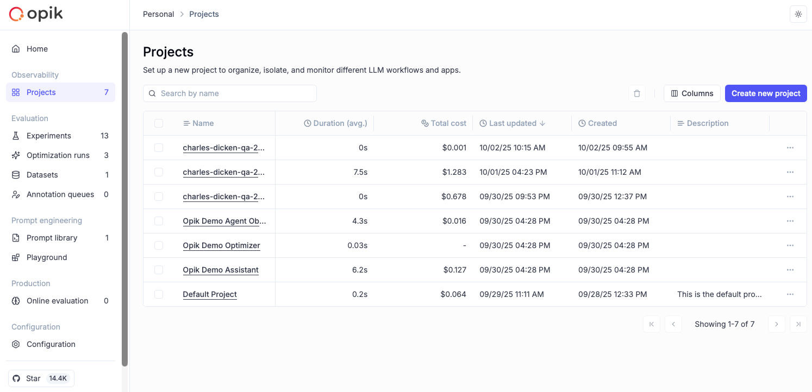
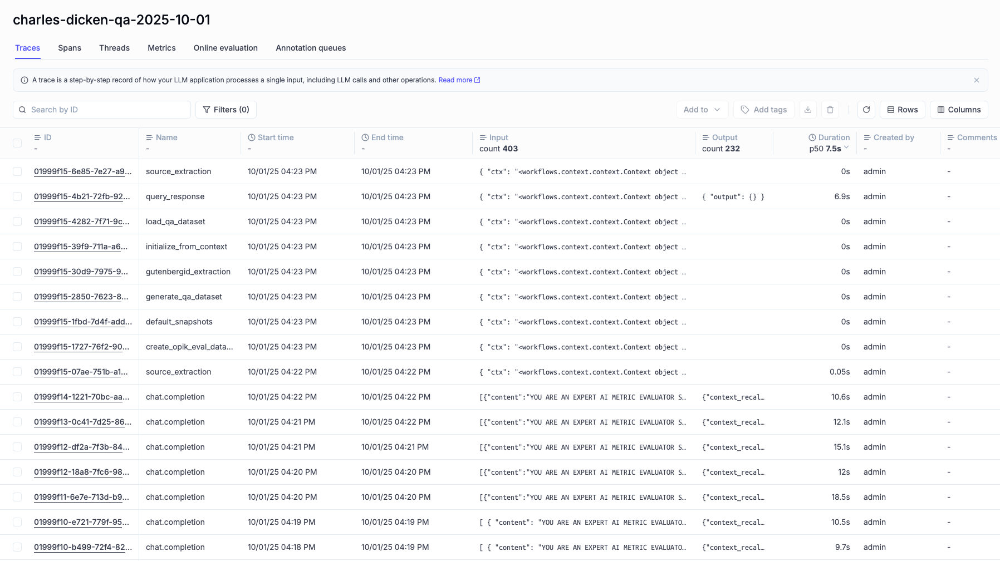
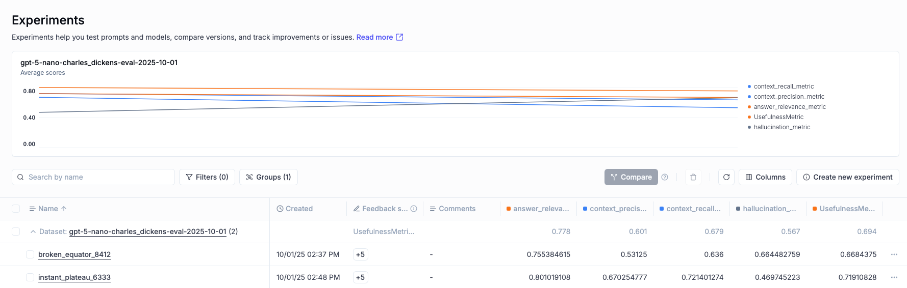
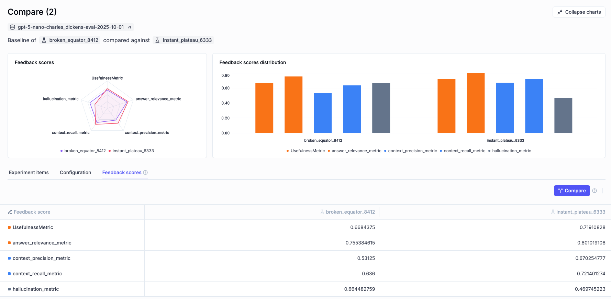
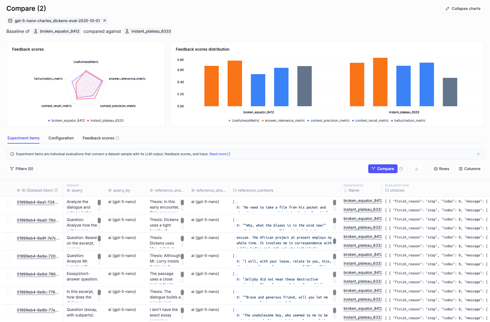
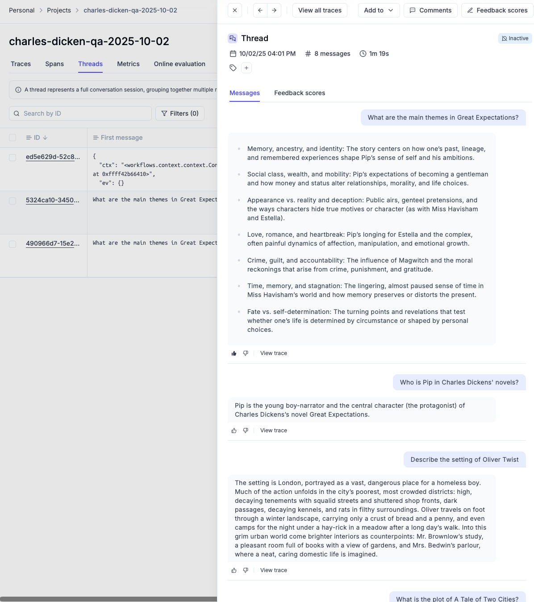
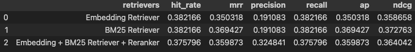

# Architecture

## Qdrant Vector Store
Qdrant stores the vector embeddings used for retrieval and supports hybrid search (dense + sparse BM42). A prebuilt snapshot in `qdrant_snapshots/` warms the collection on first start so queries run immediately.

  

<em>Figure: Qdrant dashboard for vector and hybrid search.</em>

## FastAPI Backend
The backend exposes a simple API that the Streamlit UI and tools call. It hosts a single RAGFlow instance, loads context from Redis on startup, and provides health, config, initialize, and query endpoints.

  

<em>Figure: Explore and test endpoints via FastAPI docs.</em>

## LlamaIndex Workflow

  

<em>Figure: End-to-end RAG workflow orchestrated with LlamaIndex Workflows.</em>

The core RAG logic lives in `src/charles_dicken_qa_chatbot/workflow.py` as a LlamaIndex Workflow class (`RAGFlow`). Workflows are event-driven and use `@step` decorators to chain operations:

1. **Ingestion Pipeline**: Documents → SentenceSplitter (512 chunks, 64 overlap) → TitleExtractor → Embeddings → Qdrant
2. **Retrieval Strategy**: Three retrievers evaluated on synthetic QA dataset, best one auto-selected:
   - Embedding retriever (OpenAI embeddings)
   - BM25 retriever
   - Hybrid (Embedding + BM25 + Reranker with cross-encoder/ms-marco-MiniLM-L4-v2)
3. **Query Flow**: Query → Retriever → Response Synthesizer → Answer (tracked in Opik)

## Context Persistence
- Workflow context (including nodes, retriever config, best_retriever_idx) is serialized to Redis (`ctx` key) on shutdown
- On startup, API loads context from Redis to restore state without re-ingestion
- Default initialization uses pre-built Qdrant snapshot from `qdrant_snapshots/`

## Key Components

**Core Library** (`src/charles_dicken_qa_chatbot/`):
- `workflow.py`: Main RAGFlow workflow with ingestion, retrieval eval, response eval, and query steps
- `ingestion.py`: Document extraction (Gutenberg + Wikipedia), pipeline creation
- `config.py`: LLM/embed model factories, vector store, Redis cache setup
- `evaluation.py`: Opik-based response evaluation (Hallucination, Usefulness, etc.) and retrieval metrics
- `utils.py`: Retriever creation, custom EmbeddingBM25RerankerRetriever class

**API** (`src/api/`):
- `api.py`: FastAPI backend with lifespan context loading, `/query`, `/initialize`, `/config` endpoints
- `schemas.py`: Pydantic models for request/response

**UI** (`src/chat/`):
- `app.py`: Streamlit chat interface that calls FastAPI backend

**Infrastructure** (`infra/`):
- `docker-compose.yaml`: Multi-service orchestration with profiles (`opik`, `app`)
- `Dockerfile.api`, `Dockerfile.streamlit`: Service containers
- Init container uploads Qdrant snapshot on first startup

## Opik Integration

  

<em>Figure: LLM projects tracking in Opik.</em>

  

<em>Figure: Opik traces show step-level execution for each query.</em>

- All workflow steps decorated with `@opik.track` for automatic tracing
- Conversations tracked with thread_id for multi-turn monitoring (conversations)

Metric glossary (what each score means):
- UsefulnessMetric: How helpful the answer is for the user’s task and question intent. Higher is better.
- answer_relevance_metric: How well the answer stays on-topic and addresses the asked question. Higher is better.
- context_precision_metric: Of the contexts the model relied on, what fraction were truly relevant (low noise). Higher is better.
- context_recall_metric: Coverage of relevant contexts found and used by the system (did we miss key evidence). Higher is better.
- hallucination_metric: Degree of unsupported or fabricated content in the final answer. Lower is better.

Note:
- Prefer runs with higher usefulness/relevance and precision/recall, and lower hallucination. If two runs tie, pick the one with lower variance across items.

> Starting targets:
> - Usefulness ≥ 0.70, Answer relevance ≥ 0.75
> - Context precision ≥ 0.60, Context recall ≥ 0.65
> - Hallucination ≤ 0.30
>
> Tune thresholds to your dataset and risk tolerance; prefer improvements that raise usefulness without increasing hallucination.

  

<em>Figure: Side-by-side comparison of runs across key feedback metrics.</em>

  

<em>Figure: Experiments overview to compare average metrics across runs.</em>

  

<em>Figure: Detailed feedback scores per run (usefulness, relevance, precision/recall, hallucination).</em>

  

<em>Figure: Conversations from the Streamlit UI logged and scored in Opik.</em>

## Retrieval Evaluation
Retrieval evaluation for retriever selection is run outside Opik. It compares embedding, BM25, and hybrid strategies and summarizes ranking metrics used to pick `best_retriever_idx`.

Metrics explained (top‑k unless noted):
- Hit rate: Percent of queries where at least one relevant document appears in the top‑k results (coverage at a glance). Higher is better.
- MRR (Mean Reciprocal Rank): Average of 1/rank of the first relevant result; rewards putting the first relevant item very high. Higher is better.
- Precision: Fraction of the top‑k results that are relevant; measures noise. Higher is better.
- Recall: Fraction of all relevant documents that were returned in the top‑k; measures coverage. Higher is better.
- AP (Average Precision): Averages precision over the ranks where relevant items occur; balances ranking and completeness. Higher is better.
- nDCG (Normalized Discounted Cumulative Gain): Rewards placing relevant results near the top using graded relevance; normalized to [0,1]. Higher is better.

Interpretation and selection:
- Use recall and hit rate to ensure the retriever surfaces enough relevant context; use precision/MRR/nDCG to ensure those appear near the top.
- Hybrid (dense + sparse) with a reranker often improves precision without sacrificing recall. Choose the retriever that best matches your target metric (e.g., maximize hit rate with acceptable precision at k=3).

> Starting targets with k=3:
> - Hit rate ≥ 0.80, MRR ≥ 0.60, nDCG ≥ 0.70
> - Keep precision and recall balanced; accept a small recall drop if a reranker yields a meaningful precision gain.

  

<em>Figure: Retrieval evaluation across retrievers with only sampled 5% of total chunks.</em>

## Storage Stack
- See Qdrant section above for vector and hybrid search details.
- **Redis** (port 6380):
  - RedisDocumentStore: Original documents
  - RedisIndexStore: Index metadata
  - RedisCache: Ingestion pipeline cache
  - Workflow context serialization (`ctx` key)

## Services & Ports

- Qdrant: 6333 (HTTP), 6334 (gRPC)
- Redis: 6380 external (container 6379)
- API (FastAPI): 8001
- Streamlit: 8501
- Opik: 5173 (web UI; API at /api)

Compose profiles:
- `opik`: Opik monitoring stack
- `app`: Streamlit UI service
